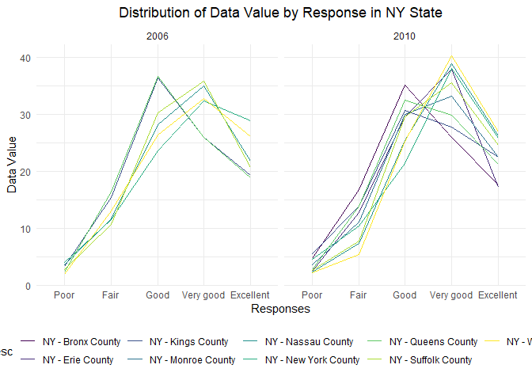
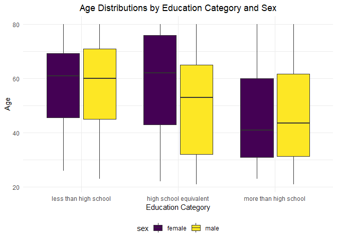

p8105_hw3_sjk2254
================
Sharon Kulali

## SetUp

``` r
# loading the needed libraries

library(tidyverse)
library(p8105.datasets)
library(patchwork)
```

``` r
# setting visuals for plots

theme_set(theme_minimal() + theme(legend.position = "bottom"))

options(
  ggplot2.continuous.colour = "viridis",
  ggplot2.continuous.fill = "viridis"
)

scale_colour_discrete = scale_colour_viridis_d
scale_fill_discrete = scale_fill_viridis_d
```

## Problem 1

``` r
# loading the dataset

data("instacart")

# looking at the dataset

insta_df = instacart |> 
  as_tibble()
```

Instacart is an online grocery shopping service that allows individuals
to shop online from local stores. The platform offers same-day delivery
with purchases being able to be delivered within 2 hours. The `insta_df`
dataset contains the online grocery orders from Instacart users in 2017.
There are 15 variables with 1384617 observations. More specifically, the
dataset has information about identifiers for the order (`order_id`),
product (`product_id`), customer (`user_id`), aisle (`aisle_id`), and
department (`department_id`). Additionally, there is information about
the specific day (`order_dow`) and hour (`order_hour_of_day`) that the
orders were placed. In total, there are 39123 products found in 131209
orders from 131209 distinct users.

``` r
# examining the aisles

insta_df |> 
  group_by(aisle_id, aisle) |> 
  count() |> 
  arrange(desc(n))
```

    ## # A tibble: 134 × 3
    ## # Groups:   aisle_id, aisle [134]
    ##    aisle_id aisle                              n
    ##       <int> <chr>                          <int>
    ##  1       83 fresh vegetables              150609
    ##  2       24 fresh fruits                  150473
    ##  3      123 packaged vegetables fruits     78493
    ##  4      120 yogurt                         55240
    ##  5       21 packaged cheese                41699
    ##  6      115 water seltzer sparkling water  36617
    ##  7       84 milk                           32644
    ##  8      107 chips pretzels                 31269
    ##  9       91 soy lactosefree                26240
    ## 10      112 bread                          23635
    ## # ℹ 124 more rows

The table above shows the the aisles arranged in decreasing order by
most items. Overall, there are 134 different aisles with fresh
vegetables and fruits being the most ordered items.

``` r
# plotting the number of items ordered per aisle

insta_df |> 
  count(aisle) |> 
  filter(n > 10000) |>
  mutate(aisle = fct_reorder(aisle, n)) |> 
  ggplot(aes(x = aisle, y = n)) +
  geom_point() +
  theme(axis.text.x = element_text(angle = 60, vjust = 1, hjust=1)) +
  ggtitle("Number of Items Ordered in Each Aisle") +
  theme(plot.title = element_text(hjust = 0.5))
```

<!-- -->

The plot above shows the number of items ordered in each aisle for
aisles with more than 10,000 items ordered. You can see that fresh
vegetables and fruits are the most ordered items because they have the
highest points.

``` r
# creating a table for the three most popular items

insta_df |> 
  filter(aisle %in% c("baking ingredients","dog food care","packaged vegetables fruits")) |>  
  group_by(aisle) |> 
  count(product_name) |> 
  arrange(desc(n)) |> 
  top_n(n = 3) |> 
  knitr::kable()
```

| aisle                      | product_name                                  |    n |
|:---------------------------|:----------------------------------------------|-----:|
| packaged vegetables fruits | Organic Baby Spinach                          | 9784 |
| packaged vegetables fruits | Organic Raspberries                           | 5546 |
| packaged vegetables fruits | Organic Blueberries                           | 4966 |
| baking ingredients         | Light Brown Sugar                             |  499 |
| baking ingredients         | Pure Baking Soda                              |  387 |
| baking ingredients         | Cane Sugar                                    |  336 |
| dog food care              | Snack Sticks Chicken & Rice Recipe Dog Treats |   30 |
| dog food care              | Organix Chicken & Brown Rice Recipe           |   28 |
| dog food care              | Small Dog Biscuits                            |   26 |

The table above shows three most popular items in each of the aisles
baking ingredients, dog food care, and packaged vegetables fruits. You
can see that packaged vegetables fruits has the most orders out of the
three aisles.

``` r
# creating a table for ice cream orders

insta_df |> 
  filter(product_name %in% c("Pink Lady Apples","Coffee Ice Cream")) |> 
  group_by(product_name, order_dow) |> 
  summarize(mean_hr = mean(order_hour_of_day)) |> 
  pivot_wider(
    names_from = order_dow,
    values_from = mean_hr) |> 
  knitr::kable(digits = 2)
```

| product_name     |     0 |     1 |     2 |     3 |     4 |     5 |     6 |
|:-----------------|------:|------:|------:|------:|------:|------:|------:|
| Coffee Ice Cream | 13.77 | 14.32 | 15.38 | 15.32 | 15.22 | 12.26 | 13.83 |
| Pink Lady Apples | 13.44 | 11.36 | 11.70 | 14.25 | 11.55 | 12.78 | 11.94 |

The table above shows the mean hour of the day at which Pink Lady Apples
and Coffee Ice Cream are ordered on each day of the week. You can see
that on average, Coffee Ice Cream is ordered more than Pink Lady Apples.

## Problem 2

``` r
# loading the dataset

data("brfss_smart2010")

# looking at the dataset

brfss_df = brfss_smart2010 |> 
  as_tibble()
```

``` r
# cleaning the dataset

brfss_df =
  brfss_df |> 
  janitor::clean_names() |> 
  filter(topic == "Overall Health") |> 
  filter(response %in% c("Poor","Fair","Good","Very good","Excellent")) |> 
  mutate(response = fct_relevel(response, c("Poor","Fair","Good","Very good","Excellent")))
```

The Selected Metropolitan Area Risk Trends (SMART) project uses the
Behavioral Risk Factor Surveillance System (BRFSS) to analyze data from
counties. The BRFSS is a government data set that is primary used to
identify emerging health problems, establish and track health
objectives, and develop and evaluate public health policies and
programs. The dataset (`brfss_df`) has 23 variables with 10625
observations and data ranging from years 2002 to 2010. This dataset
focuses on the health topic “Overall Health”, specifically for responses
from “Poor” to “Excellent”.

``` r
# filtering the data for 2002

brfss_df |> 
  filter(year == "2002") |> 
  group_by(locationabbr) |>
  summarise(num_locations = n_distinct(locationdesc)) |> 
  filter(num_locations >= 7)
```

    ## # A tibble: 6 × 2
    ##   locationabbr num_locations
    ##   <chr>                <int>
    ## 1 CT                       7
    ## 2 FL                       7
    ## 3 MA                       8
    ## 4 NC                       7
    ## 5 NJ                       8
    ## 6 PA                      10

In 2002, 6 states, CT, FL, MA, NC, NJ, and PA, were observed at 7 or
more locations.

``` r
# filtering the data for 2010

brfss_df |> 
  filter(year == "2010") |> 
  group_by(locationabbr) |> 
  summarise(num_locations = n_distinct(locationdesc)) |> 
  filter(num_locations >= 7)
```

    ## # A tibble: 14 × 2
    ##    locationabbr num_locations
    ##    <chr>                <int>
    ##  1 CA                      12
    ##  2 CO                       7
    ##  3 FL                      41
    ##  4 MA                       9
    ##  5 MD                      12
    ##  6 NC                      12
    ##  7 NE                      10
    ##  8 NJ                      19
    ##  9 NY                       9
    ## 10 OH                       8
    ## 11 PA                       7
    ## 12 SC                       7
    ## 13 TX                      16
    ## 14 WA                      10

In 2010, 14 states, CA, CO, FL, MA, MD, NC, NE, NJ, NY, OH, PA, SC, TX,
and WA, were observed at 7 or more locations.

``` r
# creating a a limited dataframe

lm_df =
  brfss_df |> 
  filter(response == "Excellent") |> 
  group_by(year, locationabbr, locationdesc) |> 
  summarize(average_data_value = mean(data_value), .groups = "drop")
```

The above dataframe is limited to “Excellent” responses, and contains,
year, state, and a variable that averages the data_value across
locations within a state.

``` r
# creating a spaghetti plot

lm_df |> 
  ggplot(aes(x = year, y = average_data_value, group = locationabbr, color = locationabbr)) +
  geom_line() +
  labs(
    x = "Year",
    y = "Average Data Value",
    title = "Spaghetti Plot of Average Value Over Time by State"
  ) +
  theme(plot.title = element_text(hjust = 0.5)) +
  theme(legend.key.size = unit(0.3, "lines"), legend.key.height = unit(0.3, "lines"))
```

<!-- -->

The “spaghetti” plot above shows the average percentage of individuals
that responded “Excellent” over time within a state. You can see that
there is a lot of fluctuation in all the states and there isn’t an
average greater than 30%.

``` r
# making a two-panel plot

brfss_df |> 
  filter(year %in% c(2006, 2010), locationabbr == "NY") |> 
  ggplot(aes(x = data_value, fill = response)) +
  geom_histogram(bins = 20, position = "dodge") +
  facet_wrap(~year, nrow = 1) +
  labs(
    x = "Data Value",
    y = "Frequency",
    title = "Distribution of Data Value by Response in NY State"
  ) +
  theme(plot.title = element_text(hjust = 0.5))
```

<!-- -->

The two-panel plot above shows the distribution of data value for
responses (“Poor” to “Excellent”) among locations in NY state. You can
see that on average, 2010 (right side) had higher data values than 2006
(left side).

## Problem 3

``` r
# loading the data sets

accel_df = read_csv("data/nhanes_accel.csv")

dem_df = read_csv("data/nhanes_covar.csv", skip = 4, na = c("NA", "Na"))
```

The National Health and Nutrition Examination Survey (NHANES) conducted
a study looking at the accelerometers which are devices that measure
vibration primarily used to study physical activity. They can measure
Monitor-Independent Movement Summary (MIMS) in one minute intervals. The
accelerometer dataset (`accel_df`) shows the accelerometer data for the
MIMS values for each minute of a 24-hour day starting at midnight. There
are 1441 variables with 250 observations. The demographic dataset
(`dem_df`) shows the participants’ demographic data. There are 5
variables with 250 observations. It includes information about their
sex, age, bmi, and education level.

``` r
# cleaning the accelerator dataset

accel_df =
  accel_df |> 
  janitor::clean_names()|> 
  pivot_longer(
    min1:min1440,
    names_to = "minute",
    names_prefix = "min",
    values_to = "mims_values"
  )
```

The updated dataset was tidied to make the variable names neater and to
make the minutes and MIMS values into their own columns.

``` r
# cleaning the demographic dataset

dem_df =
  dem_df |> 
  janitor::clean_names() |> 
  mutate(
    sex = case_match(sex,
      1 ~ "male",
      2 ~ "female"),
    education = case_match(education,
      1 ~ "less than high school",
      2 ~ "high school equivalent",
      3 ~ "more than high school")
    ) |> 
  filter(age >= "21") |> 
  drop_na()
```

The updated dataset was tidied to make the variable names neater,
exclude participants less than 21 years of age as well as those with
missing demographic data, and encode the data with reasonable variable
classes.

``` r
# joining the datasets

ac_dem_df =
  inner_join(accel_df, dem_df)
```

The two datasets were merged based on their id’s which were labeled
“seqn”. This dataset had 7 variables with 328320 observations.

``` r
# creating a table for sex + education

ac_dem_df |> 
  group_by(sex, education) |>
  summarise(count = n())|> 
  knitr::kable()
```

| sex    | education              | count |
|:-------|:-----------------------|------:|
| female | high school equivalent | 33120 |
| female | less than high school  | 40320 |
| female | more than high school  | 84960 |
| male   | high school equivalent | 50400 |
| male   | less than high school  | 38880 |
| male   | more than high school  | 80640 |

The table above shows the number of men and women in each education
category. You can see that most males and females have more than a high
school education.

``` r
# visualizing the age distribution

ac_dem_df |> 
  ggplot(aes(x = education, y = age, fill = sex))+
  geom_boxplot() +
  labs(
    x = "Education Category",
    y = "Age",
    title = "Age Distributions by Education Category and Sex"
  ) +
  theme(plot.title = element_text(hjust = 0.5))
```

<!-- -->

The plot above shows the age distributions for men and women in each
education category. You can see that in all categories, there’s no age
greater than 80. The median age for females in the educational
categories are greater than males except for the “more than high school”
category.

``` r
# male vs. female per education plot

ac_dem_df |> 
  group_by(seqn, sex, education, age) |> 
  summarise(total_activity = sum(mims_values)) |> 
  ggplot(aes(x = age, y = total_activity, color = sex)) +
  geom_point() +
  geom_smooth(method = "lm", se = FALSE) +
  facet_wrap(~education) +
  labs(
    x = "Age",
    y = "Total Activity",
    title = "Total Activity vs. Age by Education Level"
  ) +
  theme(plot.title = element_text(hjust = 0.5))
```

<!-- -->

The plot above compares the men to women at each education level. A
total activity variable was created that sums the MIMS values for each
participant. You can see that in all education levels, there was a
negative trend showing that as age increases, total activity decreases.
This was similar for both women and men. On average, females have higher
total activity than men except in the “less than high school” education
category where at roughly age 45, there’s a switch and males start to
have higher values.

``` r
# making a 3-panel plot

ac_dem_df |> 
  mutate(minute = as.numeric(minute),
         hour = (minute - 1) %/% 60 + 1) |> 
  group_by(hour, education, sex) |> 
  summarise(average_activity = mean(mims_values)) |> 
  ggplot(aes(x = hour, y = average_activity, color = sex)) +
  geom_line() +
  scale_x_continuous(n.breaks=24) +
  facet_wrap(~education, ncol = 1) +
  labs(
    x = "Hour of the Day",
    y = "Average MIMS Value",
    title = "24-Hour Activity Time Courses by Education Level"
  ) +
  theme(axis.text.x = element_text(angle = 90, vjust = 1, hjust=1)) +
  theme(plot.title = element_text(hjust = 0.5))
```

<!-- -->

The plot above shows the 24-hour average activity time courses for each
sex based on each education level. You can see that in all educational
levels, there is little activity in the beginning hours (roughly 1 - 5),
an increase in activity (roughly 5 - 10), a fairly steady amount of
activity (roughly 10 - 19), and lastly, there is a decrease in activity
(roughly 19 - 24). This could be due to sleeping patterns. In the early
hours (roughly 1 - 5), most people are asleep, then they get up and
start exercising (roughly 5 - 10). This then steadies off (roughly 10 -
19) due to people’s general exercise habits then there’s a decrease
(roughly 19 - 24) as people go to sleep.
